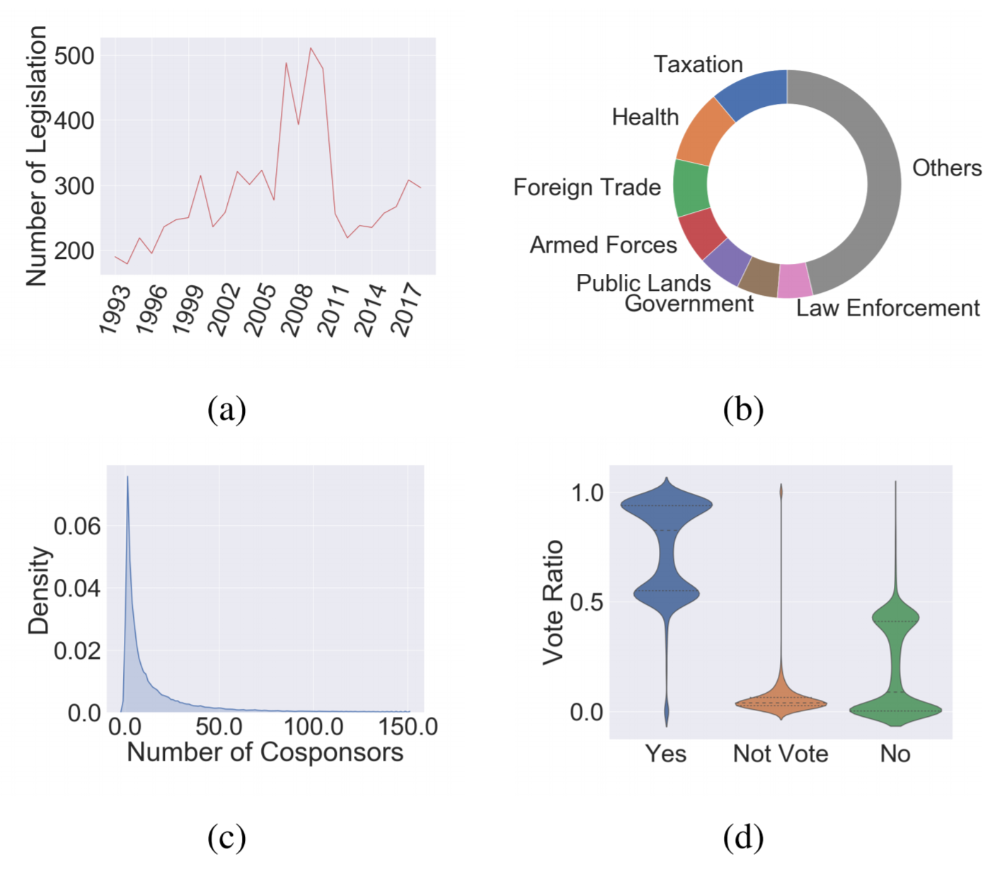

# Dataset for Joint-Representation-Learning-of-Legislator-and-Legislation-for-Roll-Call-Prediction

The dataset is collected from the Congress website in U.S. (http://www.congress.gov/) , including both legislation information and roll call results from 1993 to 2018. There are 215,857 legislation in total, with 2,234,082 voting records. 2,347 legislators are involved in this dataset. We present the change of numbers of legislation along the time span in Figure a.

**Legislator.** A legislator is a person who writes and passes laws, especially someone who is a member of a legislative body. Our targets here are Members of the U.S. House of Representatives. The total number of voting representatives is fixed by law at 435, and the term of office of the members is two years, with no limit for re-election (the re-election rate is around 81.91%). Every member owns an ID and has information about party and state. 

**Legislation.** The legislation is a law which has been promulgated by a legislature or in the process of making it. Before an item of legislation becomes a law, it may be known as a bill and can be broadly referred to as “legislation” (we use legislation through this paper). Every legislation belongs to a specific policy area and it has related textual information of title and description. We list the proportion of legislation in different policy areas in Figure b. A legislation is initialized by a group of congressmen, consisting of a sponsor and several co-sponsors. The distribution of the numbers of co-sponsors is shown in Figure c.

**Roll call record.** A roll call record contains voting results of legislators with respect to a legislation. There are three types of voting results, namely, “yeas” (yes), “nays” (no), and “not vote”. The distribution of voting results can be seen in Figure d.

# house_vote.json

Includes all roll-call records from the United States House of Representatives from 1993 to 2018.

# senate_vote.json

Includes all roll-call records from the United States Senate from 1993 to 2018.

# legislation.json

Includes all legislation from 1993 to 2018.

# member_dic.json

A look-up table to get the legislator's ID from it is name.

